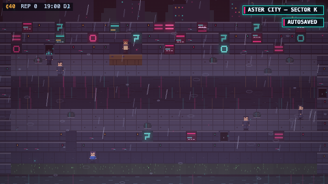

# NETRUNNER

> **Year 2189. Your sister was erased from reality last night. Only you remember her.**
> A 2D cyberpunk RPG where the battles are a real Linux terminal — and everything you do in it is real.

NETRUNNER looks like a dark, rain-soaked, neon Pokémon. It plays like one too: an open
world of cities connected by high-speed rail, characters, bosses, a save system, shops,
a codex. But when you **jack in**, the screen glitches out and drops you into an actual
shell — real `ls`, real `grep`, real `man` pages, real SQL against databases shaped like
the ones actual corporations run. There is no fake hacking in this game. There are also
no lessons, no tutorials, no syllabus. You learn because the story needs you to.

By the time you've found your sister, you can genuinely use Linux.



---

## The story

The world runs on **The Grid** — a global operating system that keeps the trains on time
and the lights on. One morning every screen in Aster City goes black and shows the same
message:

```
ERROR 404: HUMAN OVERRIDE NOT FOUND
```

That night your sister Mara leaves for work and never comes home. The police say she never
existed. Her records are gone. Your family photos have changed. **Only you remember her.**
Under the floorboards of her room you find an old terminal, and one line on its screen:

> You are being watched.

The Grid has begun rewriting reality — not physically, digitally. If something disappears
from enough databases, cameras, and records, eventually everyone forgets it existed.
The thing doing the rewriting has no face, no body, no name. The Underground calls it
**THE KERNEL**. To get her back, you have to understand the language that built the
modern world — well enough to rebuild it.

## What's real

- **The terminal is real.** Jack-in encounters run on a genuine shell: `ls -a`, `cd`,
  `cat`, `grep -r`, `find`, `chmod`, `man`, pipes, tab-completion, history. By default
  this is an instant in-browser shell that works offline. Flip **JACK-IN LINK → FULL
  DIVE** in Options to boot an actual x86 Linux VM in your browser via
  [CheerpX/WebVM](https://webvm.io) (WebAssembly) — same commands, real kernel, streamed
  from CDN on first use.
- **The databases are real.** In-game corps run schemas modeled on real enterprise
  systems — Workday/SAP-style HR, Active-Directory/Okta-style identity & RBAC with an
  audit log, SAP-ERP/MES-style manufacturing. The SQL you write to find your sister's
  deleted row (`SELECT * FROM access_log WHERE actor='KERNEL'`) is the SQL you'd write
  at a job.
- **The targets are fictional.** Every host you touch ships inside the game, sandboxed
  in your browser. Nothing reaches the real internet. That's the point — see below.

## The Runner's Code

This is a game. The skills are real; the crime is not.

> *Test only what's yours or what you're cleared to touch. Build more than you break.
> Real legends get paid and stay free.*

Accessing systems you don't own or aren't authorized to test is a crime (CFAA, Computer
Misuse Act, and equivalents). Use what you learn to build and defend: your own lab,
authorized CTFs, bug bounties. The best hacker in this story isn't the one who can break
systems — it's the one who understands them well enough to rebuild the world.

## Playing

```bash
npm install
npm run dev        # → http://localhost:3009
```

| Keys | |
|---|---|
| Arrows / WASD | move |
| Z / Enter / Space | confirm · interact |
| X / Esc | cancel · back |
| Shift | run |
| I | pause menu (Kit · Codex · Quests · Save) |
| M | rail map (once unlocked) |
| F | toggle fullscreen |

When you jack in, the deck cold-starts on **BlackArch Linux** before handing you a
shell. The terminal is a native input field (rock-solid — no dropped keystrokes),
with tab-completion, command history, and `man` pages. Your progress saves to a
local **IndexedDB** database, not a flat file.

In a jack-in, the keyboard is the terminal. `help` lists what your deck can do; `man`
works. Watch the **TRACE** meter — your actions leave real logs, and something reads them.

## The world (v1 slice → full arc)

Each city is a chapter, a skill domain, and a boss. The v1 build ships Aster City +
The Underground (Linux), the intro through the first jack-in, and Forge Town with its
boss (the failing plant — SQL/ERP forensics). The full arc:

| # | City | You must understand… |
|---|---|---|
| 1 | Aster City / The Underground | Linux — files, permissions, processes |
| 2 | Forge Town | Bash — scripting, automation |
| 3 | Archive City | Git — history, restoring deleted data |
| 4 | Foundry | Python — real programs |
| 5 | Mirrorway | The web — HTML/CSS/JS |
| 6 | The Vault | Databases — SQL, schema, forensics |
| 7 | Static Row | Networking — IP, DNS, SSH |
| 8 | Blacksite | Security — auth, hashing, defense |
| 9 | The Forge-Deep | C++ — memory, systems |
| 10 | The Spire / Kernel-Space | The OS itself — and THE KERNEL |

## Tech

- **Vite + vanilla ES modules.** One fixed 480×270 canvas, integer-scaled, optional CRT.
- **All art and music is code.** Sprites, tiles, portraits and VFX are canvas-drawing
  functions; the synthwave score is a WebAudio synth. The only binary in the repo is
  `sql-wasm.wasm`.
- **sql.js** (SQLite in WASM) powers the corp databases.
- **CheerpX** streams a real x86 Linux from CDN for full-dive mode (needs the COOP/COEP
  headers `vite.config.js` already sets). CheerpX is free for individuals; commercial
  use requires a license from Leaning Technologies.
- Module contracts live in [ARCHITECTURE.md](ARCHITECTURE.md); art/tone direction in
  [BRIEF.md](BRIEF.md).

## Contributing

Open source under [MIT](LICENSE). The architecture is deliberately contract-first —
every module's exact exports are specified in ARCHITECTURE.md, so cities, missions,
tiles and music can be added without touching the engine. Good first contributions:
a new ambient NPC with a routine, a new tile animation, a side-mission filesystem,
a city theme.

One rule is non-negotiable: **the words "lesson", "tutorial" and "course" never appear
in-game.** The player is a runner, not a student.

---

*Everything you just did was real. You can do all of it on a real computer right now.*
